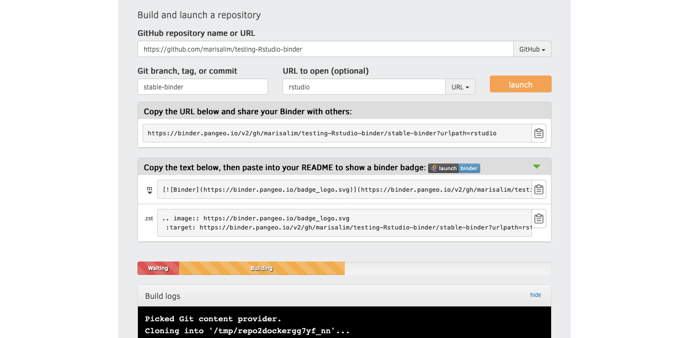

# testing-Rstudio-binder

with r (version set to 3.6), fastqc, trimmomatic, and salmon installed in binder (on `stable-binder`):

with latest version of r only (on `just-r`):

with r package ggplot in env yaml file (on `just-r-package`): 
- can you create an Rstudio binder with only an r package in yml or does it need `r-base` too? no, `r-base` is not absolutely necessary! this binder works with only `r-ggplot2` in the yml, but it also did not install most recent r version (it installed 4.0.2 instead of 4.0.3)

## Add set up docs to `./binder`
- e.g., `environment.yml`
- one of the `dependencies:` must be `r-base` or some R package, otherwise while the binder will build, the launch will fail because R must be installed during the build for Rstudio to work
- if you want certain R packages to be installed, put them in the `environment.yml` file, you don't need `runtime.txt` or `install.R` files.
- note that whatever goes in the `environment.yml` was installed when the binder opened, so if you want to demo installations of e.g., fastqc/trimmomatic/salmon with conda, don't include them in the yml file!

## Set up binder:

- enter URL, branch to point binder to (something like `stable-binder`), and in "Path to Notebook", change from default "File" to "URL" and type `rstudio` to indicate you want an Rstudio binder -> this is what sets up the binder in Rstudio. Rstudio has a Console for running R commands and a Terminal for bash. This set up is nice because you can use the Rstudio panels to e.g., show/edit text files in Source panel, run code (many computing languages available) in Console or Terminal, and see/navigate file system/plots/installed R packages.
- copy/paste the binder badge link
- click "launch". It takes a while to create.

## Helpful links
- https://www.marsja.se/how-to-use-binder-r-statistical-environment-for-reproducible-research/
- https://github.com/binder-examples/r-conda
