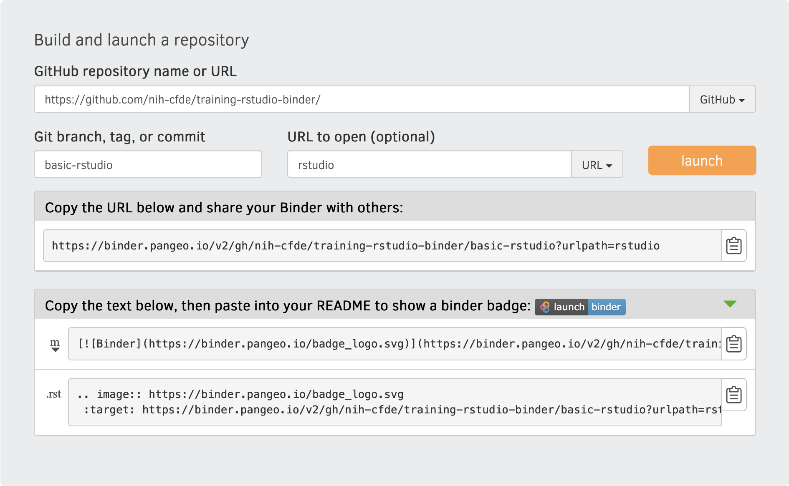

# Making a RStudio binder

What you'll need:
- GitHub account

Note: setting up a binder requires a basic understanding of using GitHub repositories and conda.

### Step 1: Create a GitHub account

If you need to create a GitHub account:
- Go to: <https://github.com>
- Enter an email and click "Sign up for GitHub"
- Follow the prompts to set up your account (user name, password) and click "Create account"
- Select the number of team members for your account and click "Continue". To set up a free account, skip the next page of options (or select options and the paid plan you'd like to set up).
- You should receive a verification email. Click "Verify email address". The link should open your new GitHub account page!                                                                                                                        
                                                                                                                                    
### Step 2: Create a GitHub repository
                                                                                                                                    
A GitHub repository (often referred to as a "repo") is like a workspace for all files, scripts, and documentation for a project. 
We can create a shareable online computer environment called a "binder" using environment specification file(s) from the repo. 
All the files in the repo will be included in the binder (i.e., scripts, inputs).                                                                                                                         

If you've **just created a new GitHub account**, after verifying your email, a page should open with a few options. Click the option to "Create a repository":
                                                                                                                                  
   
                                                                                                                                    
If you **already had a GitHub account**, starting from the home page (<https://github.com/>), click on the green "New" button in the top left corner of the page:                                                                                                                                     

                                                                      
                                                                                                                                    
- Name your repository (tip: avoid using spaces in the name, use underscore (`_`) or dash (`-`) instead)
- Select repo settings. For making a binder, the repo needs to be public (vs. private) and it's good practice to include a README, so check the box next to "Add a README file". You can update repo settings later too.                                                                                                                           
                                                                                                                   
### Step 3: Create binder environment files

For this tutorial, we're going to create our binder from a GitHub branch. This approach allows you to create new binders from different branches, without altering the `main` branch and exclude any files you do not want on the binder.                                                                    

- Create a new branch (tip: avoid using spaces in the name, use underscore (`_`) or dash (`-`) instead)
- Click the "Add file" dropdown button and select "Create new file"
- In the "Name your file" box, enter "binder/environment.yml"                                                                      
- Edit the file to add the conda channels and dependencies below. We are using conda to install R into the binder environment, which is necessary to create an RStudio binder. 
                                                                      
```
channels:
    - conda-forge
    - bioconda
    - defaults
dependencies:
    - r-base
```

After adding the above text, scroll down the page. Enter a commit message (i.e. "create env file for binder"; default message is "Create environment.yml") and click "Commit new file".

For workshops, we typically include workshop command scripts or other demo files to the main repo directory (**not** in the `binder/` directory). Add any files as needed (the files are created like the environment file, but you can change the file extensions to be i.e., ".sh" for bash files.                                                                      
                                                                      
### Step 4: Create the binder

We use [Pangeo binders](https://pangeo.io/) for workshops and lessons. Binders are flexible and shareable online computer environments. 
They can be formatted to open bash terminal, Jupyter notebook, or Rstudio interfaces. 
We often use Rstudio because it has a Console for running R commands and a Terminal for bash. 
This set up is helpful because you can use the Rstudio panels to e.g., show/edit text files in Source panel, run code (many computing languages available) in Console or Terminal, and see/navigate file system/plots/installed R packages.
                       
- Go to: <https://binder.pangeo.io/>
- Scroll down to fill in the table to "Build and launch a repository".
   - "GitHub repository name or URL": Enter your GitHub repo URL
   - "Git branch, tag, or commit": Enter your GitHub repo branch name
   - "Path to a notebook file (optional)": change the default "File" dropdown to "URL". Type `rstudio` to indicate you want to make a RStudio binder.
                                                


- Click "launch" to start building the binder. This part can take several minutes to complete. If there are any errors during the build, they will show up in the logs below all the binder settings.
- While you wait, click on the clipboard icon to copy the shareable link. We use the URL and the markdown badge in our workshop notes to share with participants.                         

### Step 5: Share binder

- Copy/paste the binder badge link to workshop notes or share the URL via email to participants                       
- After clicking the link, it typically takes 3-4 minutes for the binder to launch.
  
## Tips for using a binder
  
- Set aside time at the beginning of workshops for the binders to launch. We ask participants to click on the binder link as soon as they arrive, and by the time we've complete introductory material, the binders will usually be ready to use for the hands-on activities.
- You can edit/add files to the binder's GitHub repository at any time. However, the binder will need to be re-built after changes are made and will take a few minutes to launch. Once the binder has been built, subsequent launching should be faster.       
- The binders are generally resilient to time-out issues, but they do occur. We've found that the resolution to binder errors (i.e., 503, 504) is to close and re-launch. 
                        
  
  
  
  
